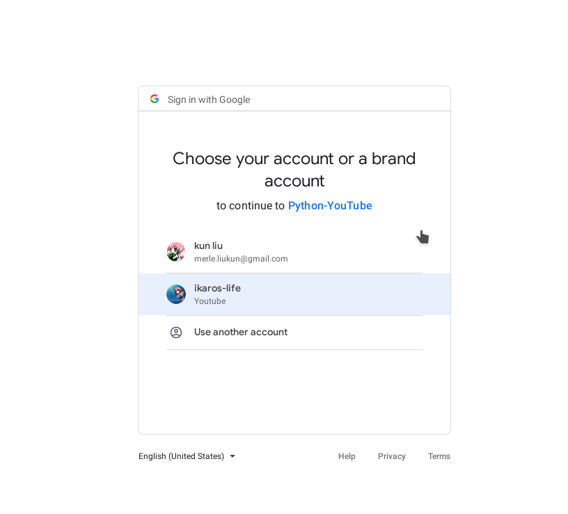
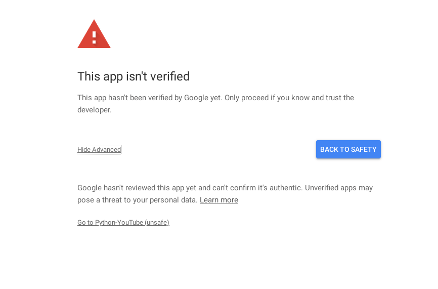
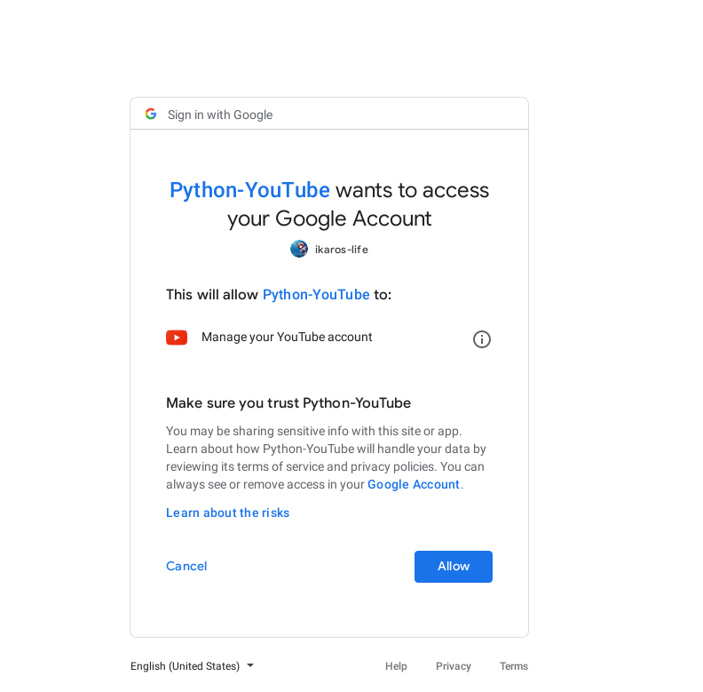

If you want to get some more data for your channel. You need provide the authorization first.

So, this doc show how to do authorize.

## Prerequisite

At the beginning. You must know what is authorization.

You can see some information at the [Official Documentation](https://developers.google.com/youtube/v3/guides/authentication).

Then you need have an app with the [Access scopes](https://developers.google.com/youtube/v3/guides/auth/server-side-web-apps#identify-access-scopes) approval by YouTube.

If everything goes well. Now let do a simple authorize with `Python-Youtube` library.

## Get authorization url

Suppose now we want to get user's permission to manage his youtube account.

For the `Python-YouTube` library, the default scopes are:

- https://www.googleapis.com/auth/youtube
- https://www.googleapis.com/auth/userinfo.profile

You can get more scope information at [Access scopes](https://developers.google.com/youtube/v3/guides/auth/server-side-web-apps#identify-access-scopes).

And We set the default redirect url is `https://localhost/`.

Now we can begin do the follows step.

Initialize the api instance with you app credentials

```
In [1]: from pyyoutube import Api

In [2]: api = Api(client_id="you client id", client_secret="you client secret")

In [3]: api.get_authorization_url()
Out[3]:
('https://accounts.google.com/o/oauth2/v2/auth?response_type=code&client_id=client_id&redirect_uri=https%3A%2F%2Flocalhost%2F&scope=https%3A%2F%2Fwww.googleapis.com%2Fauth%2Fyoutube+https%3A%2F%2Fwww.googleapis.com%2Fauth%2Fuserinfo.profile&state=PyYouTube&access_type=offline&prompt=select_account',
 'PyYouTube')
```

Now you get the authorization url, you just need copy the link, and open browser to paste the link, click the enter bar.

## Do authorization

If you enter the url. you will see this.



Now you need to chose or enter you google account with youtube.

If your app have not got the approval from youtube. You will get an warning from youtube. If you have been approved, you will
see the next image show directly.


For now, you need to click the button ``Advanced``, then click the ``Go to Python-YouTube (unsafe)``.



Now you can get a window to give permissions.



click the blue button `allow` to give the permission.

Then you will get a Connection Error, don't worry. This just because we set the redirect link to `localhost`.

## Retrieve access token

Now you need to copy the full url in the browser address bar. Then back to you console.

```
In [4]: token = api.generate_access_token(authorization_response="the whole url")

In [5]: token
Out[5]: AccessToken(access_token='access token', expires_in=3600, token_type='Bearer')
```
    

now you have got your access token to visit your self data.


## Get your data

For example, you can get your playlists.

```
In [6]: playlists = api.get_playlists(mine=True)

In [7]: playlists.items
Out[7]:
[Playlist(kind='youtube#playlist', id='PLBaidt0ilCManGDIKr8UVBFZwN_UvMKvS'),
 Playlist(kind='youtube#playlist', id='PLBaidt0ilCMbUdj0EppB710c_X5OuCP2g')]
```

get your self profile.

```
In [8]: profile = api.get_profile()

In [9]: profile
Out[9]: UserProfile(id='110109920178558006671', name='ikaros-life')
```

!!! note "Tips"

    If you have some confuse. you need to read the [Authorize Requests](https://developers.google.com/youtube/v3/guides/authentication) first.